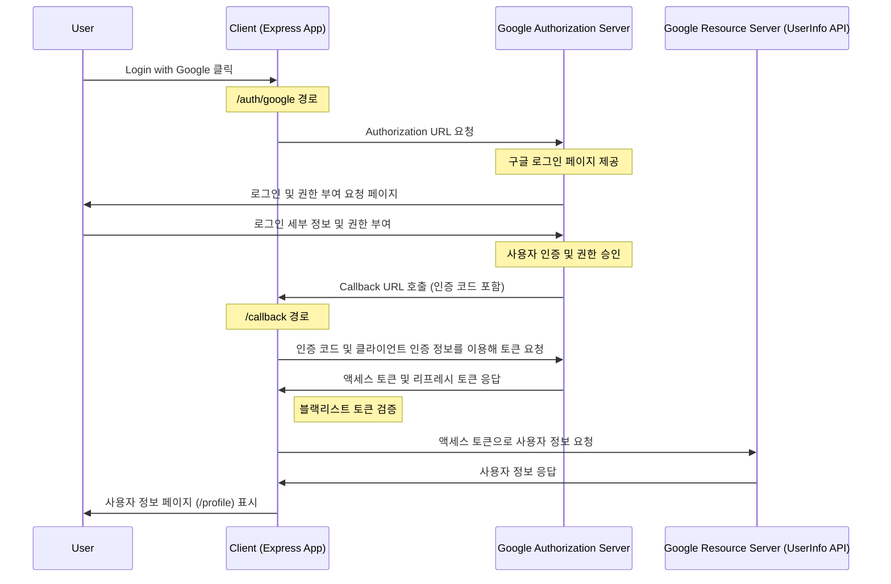

```mermaid
sequenceDiagram
    participant 사용자 as User
    participant 클라이언트 as Client (Express App)
    participant 인증서버 as Google Authorization Server
    participant 리소스서버 as Google Resource Server (UserInfo API)

    사용자->>클라이언트: Login with Google 클릭
    Note over 클라이언트: /auth/google 경로
    클라이언트->>인증서버: Authorization URL 요청
    Note over 인증서버: 구글 로그인 페이지 제공
    인증서버->>사용자: 로그인 및 권한 부여 요청 페이지

    사용자->>인증서버: 로그인 세부 정보 및 권한 부여
    Note over 인증서버: 사용자 인증 및 권한 승인
    인증서버->>클라이언트: Callback URL 호출 (인증 코드 포함)
    Note over 클라이언트: /callback 경로

    클라이언트->>인증서버: 인증 코드 및 클라이언트 인증 정보를 이용해 토큰 요청
    인증서버->>클라이언트: 액세스 토큰 및 리프레시 토큰 응답
    Note right of 클라이언트: 블랙리스트 토큰 검증
    클라이언트->>리소스서버: 액세스 토큰으로 사용자 정보 요청

    리소스서버->>클라이언트: 사용자 정보 응답
    클라이언트->>사용자: 사용자 정보 페이지 (/profile) 표시

```
